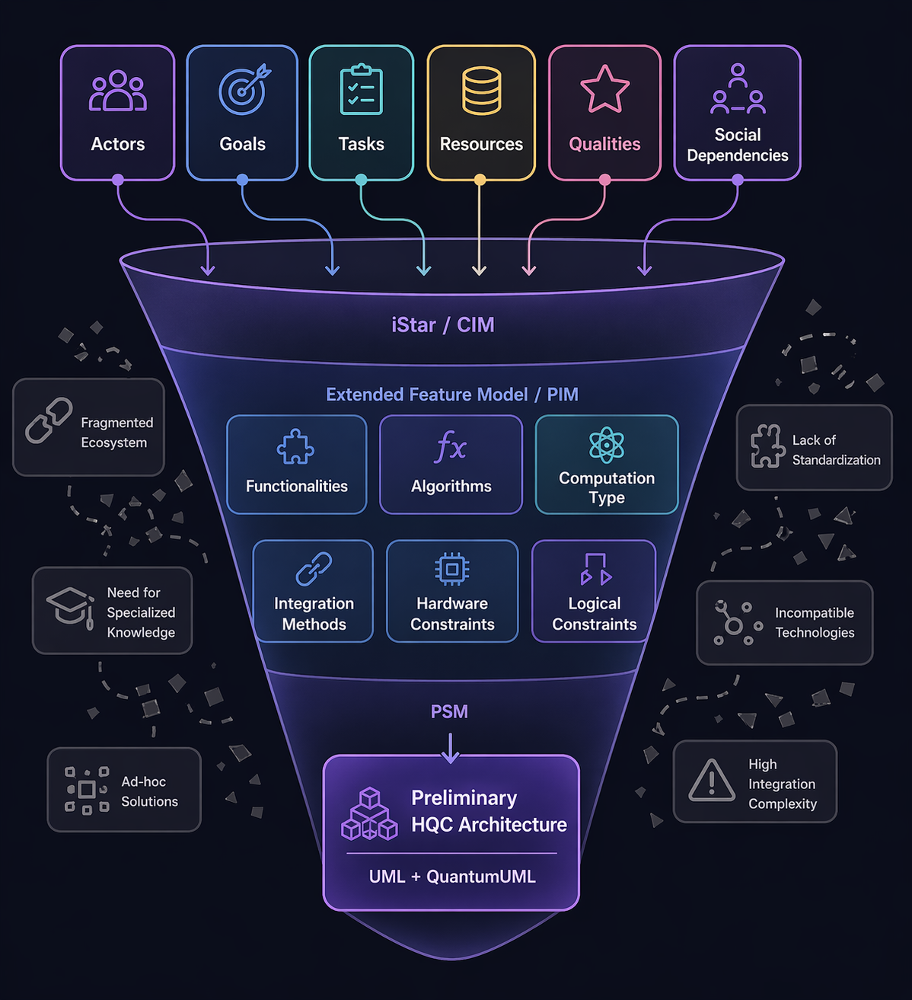
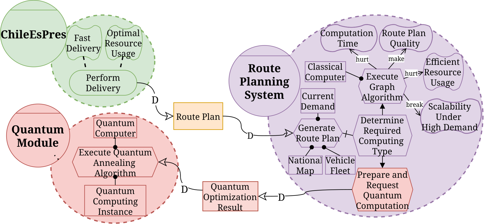
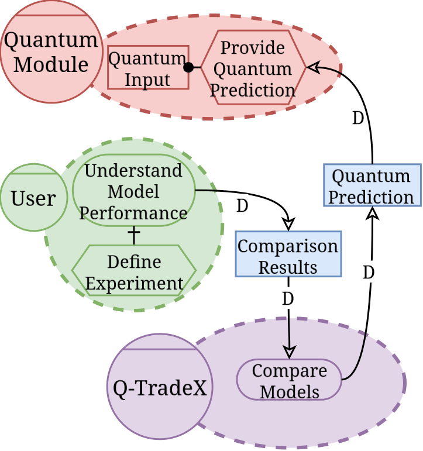
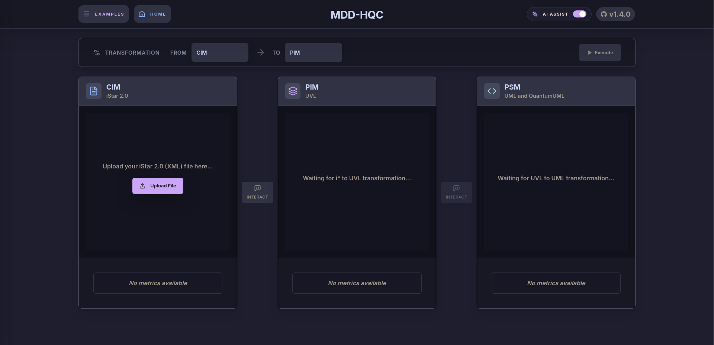
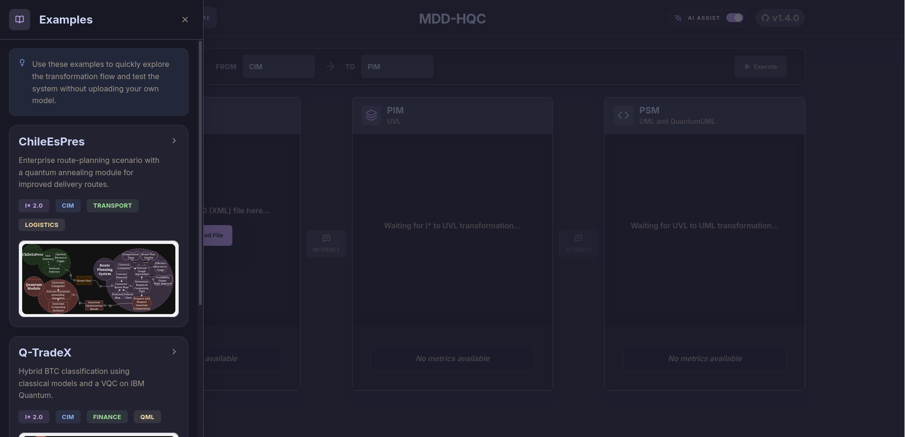
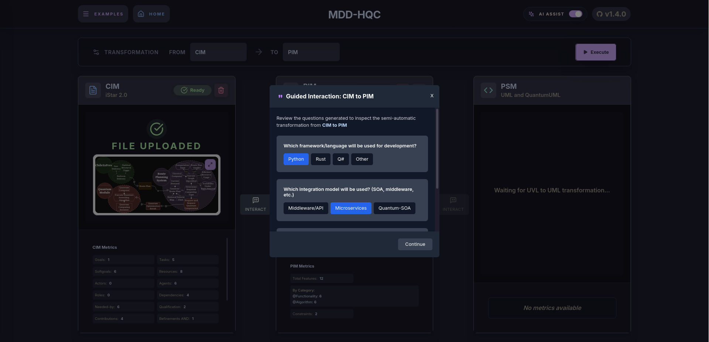
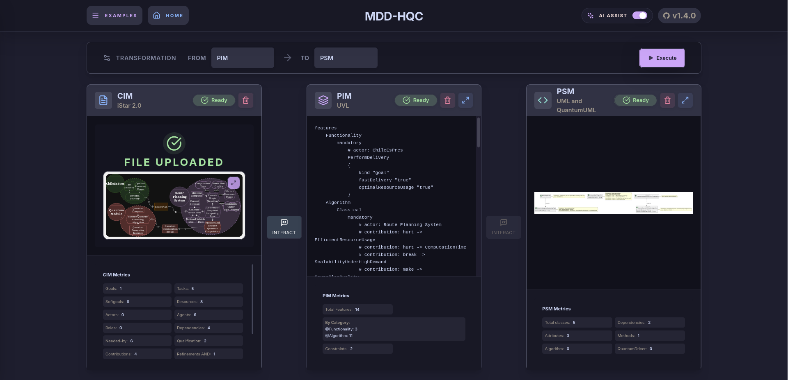
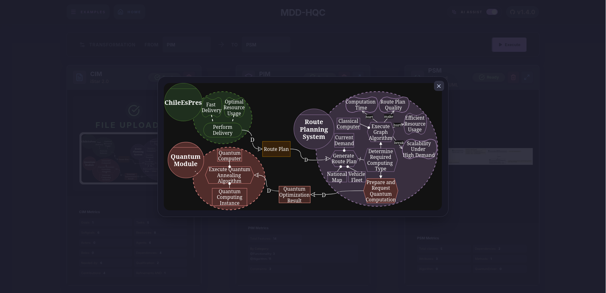
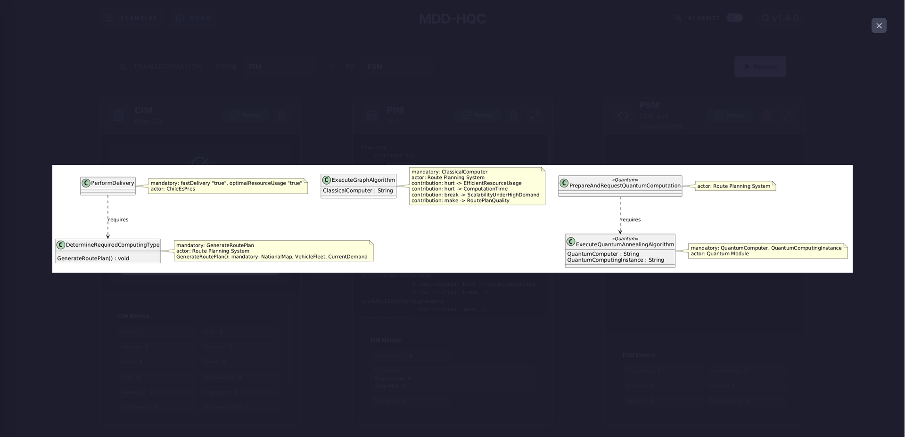
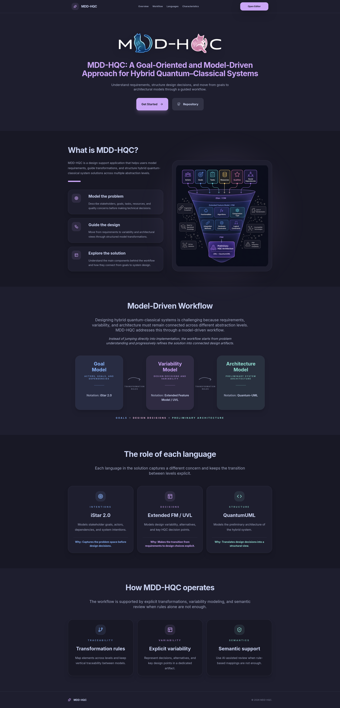

<div align="center">
  
  <p>
    <hr>
    <a href="https://fastapi.tiangolo.com"></a>
    <a href="https://python.org"></a>
    <a href="https://react.dev"></a>
    <a href="https://developer.mozilla.org/en-US/docs/Web/JavaScript"></a>
    <a href="https://www.docker.com"></a>
  </p>
  <p>
    <a href="#need-and-motivation">Need and Motivation</a> ·
    <a href="#what-it-does">What It Does</a> ·
    <a href="#system-features">System Features</a> ·
    <a href="#setup">Setup</a> ·
    <a href="#transformation-pipeline">Transformation Pipeline</a> ·
    <a href="#illustrative-cases">Illustrative Cases</a> ·
    <a href="#screenshots">Screenshots</a>
  </p>
</div>

<p align="center">
  <a href="http://200.13.5.22:3000/"><strong><font size="7">Open the Editor</font></strong></a>
</p>

> **Version:** v1.4.0<br>
> **Status:** Functional Prototype  
> **Research:** MDD-HQC was accepted at TLISC 2026, with related QuARC work accepted at Q-SET 2026.

**MDD-HQC** is a model-driven platform for supporting the design of hybrid quantum-classical systems. It provides a traceable transformation flow from **iStar 2.0** goal models to variability models written in **UVL** and **UML class diagrams** enriched with **QuantumUML** stereotypes. The platform also incorporates advisory **LLM support** to assist users during model refinement.

---

### Need and Motivation

**Hybrid quantum-classical (HQC) systems** combine classical and quantum components, assigning responsibilities to each computational paradigm according to the needs and constraints of the system.

Their development involves more than selecting a quantum algorithm. Software engineers must determine **whether**, **where**, and **how** quantum components should be incorporated into a predominantly classical system. This requires decisions concerning algorithms, integration mechanisms, quantum providers, execution backends, programming frameworks, and hardware constraints.

These decisions remain highly dependent on specialized knowledge and are often weakly connected to the original goals and requirements of the system. Without a structured development process, it becomes difficult to explain why quantum components were introduced and to trace how early requirements influenced subsequent design decisions.

MDD-HQC addresses this problem by providing a systematic and traceable path from stakeholder goals to the preliminary structure of an HQC system.

---

### What It Does

MDD-HQC supports the design of HQC systems through a **model-driven flow** organized into the **CIM**, **PIM**, and **PSM** abstraction levels.

Starting from an **iStar 2.0** goal model, the platform applies explicit transformation rules to derive an HQC variability model written in **UVL**. This model captures relevant design alternatives and constraints. A selected configuration is then transformed into a **UML class diagram** enriched with **QuantumUML** stereotypes to represent the preliminary structure of the hybrid system.

Each level progressively refines the same design problem and constrains the available solution space, while traceability metadata preserves the origin of the generated elements across transformations.

<p align="center">
  
</p>

**LLM support** complements the deterministic transformation rules by identifying potentially missing, ambiguous, inconsistent, or misplaced information. Based on these findings, the LLM generates clarification questions and suggestions for the user.

The LLM acts exclusively as an advisory mechanism: transformation decisions remain governed by explicit rules and user validation.

---

### System Features

The following table summarizes the main capabilities included in or envisioned for MDD-HQC.

> Status legend: ⬤ implemented, ◐ partial, ◯ not implemented.

| Capability | Status |
| --- | --- |
| Goal-oriented modeling of HQC requirements | ⬤ |
| Interview-based elicitation for CIM modeling | ◐ |
| CIM model generation and interactive refinement | ◯ |
| Rule-based CIM-to-PIM transformation | ⬤ |
| Rule-based PIM-to-PSM transformation | ⬤ |
| Bidirectional or multi-entry transformation flow | ◯ |
| Variability modeling for HQC design decisions | ⬤ |
| Vertical traceability across modeling levels | ⬤ |
| Assessment of semantic preservation across transformations | ◯ |
| Architecture-to-code generation | ◯ |
| Project analysis from local folders or GitHub repositories | ◯ |
| LLM-assisted detection of missing or inconsistent information | ◐ |

---

### Setup

The following tools must be installed before running the platform:

* Docker (version 20.10 or higher)
* Docker Compose (version 2.0 or higher)
* Git (for cloning the repository)

> [!NOTE]
> MDD-HQC is designed to run in a **containerized environment** using **Docker Compose**, simplifying dependency management and deployment across different systems.

#### Using Docker Compose

1. **Clone the repository:**
   ```bash
   git clone git@github.com:JessusTM/MDD-HQC.git
   cd MDD-HQC
   ```

2. **Create the backend environment file at the repository root:**

   ```bash
   cp .env.example .env
   ```

3. **Create the frontend environment file:**

   ```bash
   cp mdd-hqc-frontend/.env.example mdd-hqc-frontend/.env
   ```

   > The backend reads its configuration from the root `.env` file. The React frontend reads variables prefixed with `REACT_APP_` from `mdd-hqc-frontend/.env`.

4. **Build the images and start the services:**

   ```bash
   docker compose up --build
   ```

   This command builds the backend and frontend images and starts both services.

5. **Access the application:**

   * **Frontend:** [http://localhost:3000](http://localhost:3000)
   * **Backend API:** [http://localhost:8000](http://localhost:8000)
   * **API Documentation (Swagger):** [http://localhost:8000/docs](http://localhost:8000/docs)

6. **Stop the services:**

   ```bash
   docker compose down
   ```

> [!CAUTION]
> Ensure that ports 3000 and 8000 are available before starting the containers. If either port is already in use, its mapping can be changed in the `docker-compose.yml` file.

---

### Transformation Pipeline

The system implements a transformation flow organized into three modeling levels:

1. **CIM (Computation Independent Model):** Represents stakeholder goals, needs, intentions, and dependencies using iStar 2.0
2. **PIM (Platform Independent Model):** Represents HQC variability, design alternatives, and constraints through an extended feature model written in UVL
3. **PSM (Platform Specific Model):** Represents the preliminary structure of the HQC system through a UML class diagram enriched with QuantumUML stereotypes

<p align="center">
  
</p>

The transformations propagate origin information and metadata between levels, allowing generated elements to be traced back to the goals and design decisions from which they were derived.

The current prototype automates the **CIM-to-PIM** and **PIM-to-PSM** transformations. The resulting PSM provides a preliminary structural representation rather than a complete software architecture or final implementation. Extending this flow toward architecture-guided code generation remains part of the planned work.

---

### Illustrative Cases

The following cases demonstrate how MDD-HQC represents different hybrid quantum-classical design scenarios from stakeholder goals and system responsibilities.

<table>
  <tr>
    <td width="45%" align="center" valign="middle">
      <a href="mdd-hqc-frontend/public/images/ChileEsPres.svg">
        
      </a>
    </td>
    <td width="55%" valign="middle">
      <h4>ChileEsPres</h4>
      <p>A route-planning scenario that integrates quantum annealing to improve delivery decisions under resource and quality constraints.</p>
    </td>
  </tr>
  <tr>
    <td width="45%" align="center" valign="middle">
      <a href="mdd-hqc-frontend/public/images/Q-TradeX.svg">
        
      </a>
    </td>
    <td width="55%" valign="middle">
      <h4>Q-TradeX</h4>
      <p>Hybrid BTC classification using classical models and a VQC on IBM Quantum.</p>
    </td>
  </tr>
</table>

---

### Screenshots

<table>
  <tr>
    <td width="50%" align="center">
      
      <br>
      <sub>Main interface</sub>
    </td>
    <td width="50%" align="center">
      
      <br>
      <sub>Built-in example catalog</sub>
    </td>
  </tr>
  <tr>
    <td width="50%" align="center">
      
      <br>
      <sub>LLM-guided interaction</sub>
    </td>
    <td width="50%" align="center">
      
      <br>
      <sub>Transformation workflow</sub>
    </td>
  </tr>
  <tr>
    <td width="50%" align="center">
      
      <br>
      <sub>Enlarged CIM goal model</sub>
    </td>
    <td width="50%" align="center">
      
      <br>
      <sub>Enlarged PSM class diagram</sub>
    </td>
  </tr>
</table>

---

### Home Landing

<p align="center">
  
</p>
